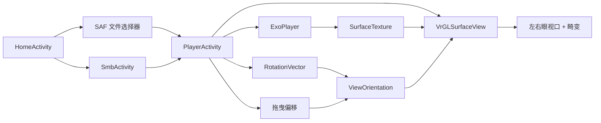

# Android VR 视频播放器

Feature Name: android-vr-video-player
Updated: 2026-09-09

## Description

原生 Android 应用，面向手机 VR 盒子。ExoPlayer 解码本地或 SMB 视频，OpenGL ES 将帧贴到球面/立方体/平面，双目分屏加桶形畸变。视角由旋转矢量传感器与单指拖曳合成，可锁定。播放页屏幕常亮，控件 3 秒无操作后隐藏。

## Architecture



数据流：文件 URI 或 SMB 路径进入 ExoPlayer；解码帧写入 `GL_TEXTURE_EXTERNAL_OES`；渲染线程按投影模式采样并绘制两眼；UI 层只负责控件、常亮与沉浸模式。

## Components and Interfaces

### HomeActivity

启动页。两个入口：打开本地视频、连接局域网共享。

### SmbActivity

填写 host / share / username / password / domain，列出目录，点击视频把连接参数交给 PlayerActivity。最近一次成功连接写入 SharedPreferences。

### PlayerActivity

横屏播放页。职责：

- 创建 ExoPlayer，绑定 `Surface(SurfaceTexture)`
- 注册 `TYPE_ROTATION_VECTOR`
- 处理单指拖曳（yaw/pitch 偏移）
- 固定视角开关冻结合成朝向
- `FLAG_KEEP_SCREEN_ON`
- 沉浸式系统栏；播放中 3 秒隐藏控件，暂停保持显示
- 投影模式、分屏开关

### VrRenderer

`GLSurfaceView.Renderer`。每帧 `updateTexImage`，用左右眼 `viewport` 各画一次。眼间距 64mm。桶形畸变在顶点着色器对 NDC xy 施加 `1 + k1*r2 + k2*r2^2`。

### ProjectionMode

| 模式 | 几何 | UV |
|------|------|----|
| EQUIRECT_360 | 球面 | 全程 0-1 |
| EQUIRECT_180 | 前半球 | 水平 180 度映射 0-1 |
| CUBEMAP_3X2 | 立方体 | YouTube 3x2 面布局 |
| STEREO_SBS | 球面 | 左眼 u=[0,0.5]，右眼 u=[0.5,1] |
| STEREO_TB | 球面 | 左眼 v=[0.5,1]，右眼 v=[0,0.5] |
| FLAT_2D | 前方平面 | 全程 0-1 |

### SmbDataSource

ExoPlayer `DataSource`。SMBJ 打开远程文件，按 `DataSpec.position` 随机读。不把整文件拷进内部存储。

### ViewOrientation

`sensorQuat * dragOffset`。Fixed View 为 true 时停止写入新朝向，渲染仍用冻结矩阵。

## Data Models

```kotlin
data class SmbTarget(
    val host: String,
    val share: String,
    val path: String,
    val username: String,
    val password: String,
    val domain: String
)

enum class ProjectionMode {
    EQUIRECT_360, EQUIRECT_180, CUBEMAP_3X2,
    STEREO_SBS, STEREO_TB, FLAT_2D
}

data class ViewState(
    val sensorYaw: Float,
    val sensorPitch: Float,
    val sensorRoll: Float,
    val dragYaw: Float,
    val dragPitch: Float,
    val fixed: Boolean
)
```

播放 Intent extras：`extra_uri`（本地 content/file URI）或 `extra_smb`（JSON SmbTarget）。

## Correctness Properties

- 同一时刻只有一个 ExoPlayer 实例；离开播放页必须 `release`
- Fixed View 打开期间传感器回调与拖曳不得改写冻结矩阵
- 分屏关闭时单视口、IPD=0、畸变关闭
- SMB 读取失败不得留下悬挂会话：`share/session/connection` 在 DataSource.close 中关闭
- 控件隐藏定时器在用户触摸或暂停时重置；仅在 `isPlaying == true` 时启动

## Error Handling

| 场景 | 处理 |
|------|------|
| 解码失败 / 不支持的编码 | Toast 中文原因，关闭播放页 |
| SMB 认证失败 | 表单页显示「用户名或密码错误」 |
| SMB 主机不可达 | 表单页显示「无法连接主机」 |
| 无陀螺仪 | 仅拖曳，不弹错误 |
| 文件为空或 0 字节 | 「无法播放该文件」 |

## Test Strategy

- 投影切换：同一 MP4 在 6 种模式间切换，进度不变
- 分屏：打开时左右画面有视差；关闭时单画面铺满
- 固定视角：打开后转动手机画面静止；关闭后恢复
- 常亮：播放页超过系统息屏时间仍亮
- 控件：播放 3 秒后隐藏；点击出现；暂停常驻
- SMB：对可达 Samba 列出目录并 seek 播放

本环境无 Android SDK，以源码交付；在 Android Studio 编译后于真机验证。

## References

[^1]: (Website) - [Android ExoPlayer Media3](https://developer.android.com/media/media3/exoplayer)
[^2]: (Website) - [SMBJ SMB2/3 client](https://github.com/hierynomus/smbj)
[^3]: (Website) - [OpenGL ES external texture](https://developer.android.com/reference/android/graphics/SurfaceTexture)
